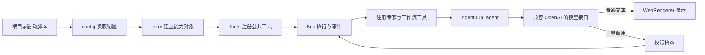

# 开发者从零读懂 AuTo_LaTeX

本文按**程序实际执行顺序**说明代码。先看入口与数据流，再看各模块负责什么，最后追踪关键函数和工作流。文件路径以仓库根目录为基准。

## 0. 先运行一个最小闭环

```powershell
python Setup.py --skip-models       # 安装依赖；首次使用前需要配置 API 密钥
python super.py --light             # Super 对话，本地网页地址会打印在终端
python terminal.py --light          # 可切换专家及持久化分支的对话
python tests/test_runtime.py        # 不调用模型或网络的运行时检查
python tests/test_light_mode.py
python tests/test_web_ui.py
python -m unittest tests.test_python_sandbox tests.test_personalization_modes
python tests/test_saver.py
```

模型端点、密钥**环境变量名**在 `settings.json`；密钥值只放环境变量。完整模式运行 `python Setup.py` 下载本地嵌入模型，可按需加 `--with-ocr`、`--with-listener`；随后去掉 `--light`。LaTeX/TikZ 检查还需系统能找到 `pdflatex`。轻量模式禁用本地向量记忆、OCR/文件识别、音频和常驻笔记，保留对话、LaTeX、SQLite 偏好与提醒、Markdown 计划和网页工具。

## 1. 启动到一次答复的主线



1. 根目录 `super.py` 和 `terminal.py` 是兼容启动壳，将 `src/` 放入导入路径并运行各自真实入口；`Setup.py` 仍在根目录。`src/config.py` 读取根目录 `settings.json`、`runtime.json`，把配置中的资源路径解析成绝对路径。
2. `src/initer.py:init(light=...)` 创建长生命周期能力对象。两种模式都创建 Plan 和 SQLite `PreferenceStore`；完整模式额外加载 Saver、Visal、Listener。轻量模式不导入重模型模块。
3. `src/tools_registry.py:register_common_tools()` 将当前可用能力注册到 `Tools`。`Tools` 从函数签名、`Annotated` 描述及 docstring 生成模型看到的工具 schema，同时保存可调用函数与超时。
4. 两个入口创建模型 client、本地 `WebRenderer`/`WebUIServer`、`Bus` 与 `CapabilityGateway`。网页服务仅监听 `127.0.0.1`；浏览器通过 HTTP 提交文本、通过 SSE 接收正文/状态。顶部提供“自动、讨论、直接、产出、探索”五种方式；自动会先把最近对话、滚动摘要和当前请求交给 LLM 判断进度，给出具体方式与理由，再等用户确认或改选，实际执行时仍注入具体方式。
5. `build_super_tools()` 为每位专家注册一个慢任务工具，并在有 Gateway 时注册 `run_workflow`；也注册按编号回查讨论原文的只读工具。Listener 可用时再建立 Resident 管理器。两种入口都用 `ConversationStore` 恢复会话及分支，并把历史检索工具注册给 Super。
6. 新分支首条用户消息到来时，`prepare_conversation()` 用它检索最多三条相关长期记忆，只注入当前模型调用，不写入聊天记录。用户回指旧对话时，Super 可调用 `ConversationStore.search_discussion_history()` 按主题搜索 SQLite 历史。长会话到 100 轮后，`prepare_conversation()` 更新滚动摘要，并将摘要与最近 40 轮送给模型；完整原文仍保留。模型给出文字时显示并结束本轮，给出工具调用时检查执行权限、调用 Bus，拿到结果后继续循环。

## 2. 独立模块的功能边界

本节只说明模块承担的独立功能；函数间关系集中在下一节。

| 模块 | 独立职责 |
| --- | --- |
| `src/config.py`、根目录三个 JSON | 模型、运行参数、工具输出目录与安装选项的配置来源。 |
| `src/experts.py` | 从配置加载专家提示词和工具集合，按轻量/完整模式筛选。 |
| `src/Saver.py` | 本地嵌入模型与 Chroma 向量记忆，支持增、查、精确删改。 |
| `src/Visal.py` | PDF/图片 OCR 与结果缓存；按 1 起算的页码识别，结果带原文件名和页码。 |
| `src/pictures.py` | 图片隐藏通道：发送后做一轮多模态信息提取；`view_picture` 需要时另发原图与具体问题。 |
| `src/listener.py` | 音频文件转写、麦克风连续监听、增量转写缓冲和事件通知。 |
| `src/plan.py` | 每日与长期 Markdown 计划读写、提醒轮询器和提醒命令显示/延期/完成。 |
| `src/latex_tools.py` | LaTeX/TikZ 写入、编译检查和定理规范读取。 |
| `src/built_in_tool.py` | 网页查询、页面抓取与天气工具。 |
| `src/str_replace_editor.py` | 受工作目录与配置保护规则约束的文件查看、创建、替换、插入。 |
| `src/render.py`、`src/web_ui.py`、`src/web_ui.html` | 终端/网页输出适配、本地页面与输入交互。 |
| `src/persistence/` | SQLite 对话、分支、图片索引、工作流、阶段记录、偏好、提醒任务与讨论摘要。 |
| `src/personalization.py` | 交互方式指导、场景偏好筛选和偏好管理命令。 |
| `src/python_sandbox.py` | 受限计算脚本运行器：语法白名单、少量标准数值模块、子进程超时和输出/集合上限。 |
| `src/discussion.py` | 新分支首轮相关记忆注入、长讨论摘要触发、滚动摘要生成与最近消息窗口。 |
| `src/runtime/` | 能力授权护照、任务上下文、阶段工作流和受限模板。 |
| `src/text_clean.py` | 文本清理辅助。 |

根目录 `plan/`、`imports/`、`my_rag_db/`、`OCR_result/`、`models/`、`runtime_state.db` 属于数据/缓存；`assets/` 放示例资源，`tests/` 放离线检查，`reports/` 放分析与方案。不要把数据目录误当作源码目录。上传只接受 PDF/PNG/JPG，单文件上限 20 MB，项目 `.gitignore` 忽略 `imports/`。图片在用户发送后写入 SQLite 图片索引并保存在 `imports/`；PDF 仍通过本机路径交给 `recognize_doc`。

## 3. 关键函数与类如何连接

| 关键节点 | 上游 → 本节点 → 下游；需要保持的关系 |
| --- | --- |
| `super.main()` / `terminal.main()` | 入口脚本 → 初始化、工具注册、Web UI、Bus、Gateway、提醒调度器 → 对话循环。terminal 用 `TerminalSession`，Super 用 `SuperSessions`；两者共用 `ConversationStore` 协议。 |
| `initer.init()` | 入口 → 创建 Plan、PreferenceStore、TaskStore，并按模式创建 Saver/Visal/Listener → `register_common_tools()` 注册实际可用工具。不要把重模型导入移到文件顶层，否则 `--light` 失效。 |
| `Tools.add_tool()` / `function_to_model()` | `register_common_tools()` 与 `build_super_tools()` → 注册函数、schema、超时 → `Agent` 展示 schema，`Bus` 运行函数。下划线开头的参数不进入模型 schema；重复注册同名工具会造成 schema 重复。 |
| `Agent.run_agent()` | 入口或专家/Resident → 以消息历史、模型、工具范围运行循环 → 模型文字或工具调用。普通路径用 `tool_names`/`deny_tools` 做可见性及执行检查；传入 `gateway`/`passport` 时从 Gateway 获取可见 schema 并经 `gateway.execute()` 授权。 |
| `Bus.submit()` / `Bus.poll()` | Agent 或 Gateway → Bus → `Tools.async_execute()`。快工具同步给 `Done/Error`；慢工具先给 `Submitted(id)`，Agent 稍后轮询并把完成值放入 `delayed_results`，由 `view_delayed_results` 供模型读取。专家/工作流标记为可重入，避免内部再次提交工具时死锁。 |
| `CapabilityGateway` / `LegacyPolicyAdapter` | 入口登记工具 schema → Gateway 建立/派生 Passport → `Agent.run_agent()` 在受控路径调用 `execute()`。`derive()` 只缩小权限；schema 隐藏只是界面，`execute()` 才是执行边界。当前入口在注册专家和 Resident 工具**之前**登记公共工具，后注册工具不自动进入 Gateway。 |
| `build_task_context()` / `build_super_tools()` | Super 的工具调用 → 抽取最近纯文本对话、创建 `TaskContext` → 用新的 `Agent` 和消息列表运行专家。专家每次调用无自己的连续会话，必须在 `task` 中携带必要上下文；工具白名单来自 `experts.py`。 |
| `TerminalSession` / `SuperSessions` / `ConversationStore` | 两个入口 → 恢复/保存会话、分支和完整原始消息 → 将当前分支消息传给 Agent 与专家上下文。`branches.group_name` 保存网页侧栏的自定义分组；删除分支会级联删除消息和摘要，若删的是当前项先切到另一项，并且至少保留一个。切换分支保持消息列表引用；terminal 切 Agent 只换 system prompt。 |
| `PreferenceStore` / `personalization.turn_context()` | `remember_preference`、`update_preference`、`forget_preference` → Bus 先询问用户 → SQLite 保存已确认规则 → 每轮按交互模式和文本关键词选取最多八条上下文。`view_preferences` 与 `export_preferences` 只读；`/preferences` 命令可直接查看、导出、添加、更新或停用。 |
| `WebRenderer.set_mode()` / `recommend_mode()` / `confirm_auto_mode()` / `compose_prompt()` | 网页下拉框或 `/mode` 命令 → Renderer 保存用户选择 → 若选 `auto`，`recommend_mode()` 把最近十条纯文本消息、已有讨论摘要和当前请求发给 LLM → `confirm_auto_mode()` 展示建议并等待确认/改选 → `set_turn_mode()` 暂存本轮具体方式 → system prompt 与专家上下文。手选方式保持生效；自动方式会在之后每次新请求重新判断。 |
| `register_common_tools()` / `run_python()` / `python_sandbox._child()` | 工具注册 → Bus 在线程中调用同步入口 → 子进程以 `-I -S` 启动、先过 AST 白名单，再运行脚本 → 返回 stdout 或错误给 Agent。脚本最多 12,000 字符、运行 5 秒、输出 20,000 字符；仅开放 `math`、`statistics`、`decimal`、`fractions`，循环、集合与整数也有上限。它限制了脚本能力，但不是针对恶意代码的操作系统级沙箱。复杂精确计算必须使用该工具并依据实测输出回答。 |
| `/api/upload` / `WebRenderer.submit_input()` / `PictureService.prepare_turn()` | 选择文件只做暂存；点发送后网页返回 `WebInput` → 图片文件与会话关联并持久化 → `PictureService` 用独立一轮视觉请求提取信息 → 主 Agent 只收到图片编号、文件名和文字提取。隐藏上下文保存在 user 消息中，网页回放时过滤。 |
| `view_picture()` / `PictureService.view_picture()` | Agent 传入图片编号和问题 → 工具检查编号是否出现在当前分支历史 → 独立一轮请求重新读取本地原图 → 文字结果作为工具结果交回 Agent；不记得编号时可省略编号列出当前分支图片。删除分支时，只在同会话其它分支不再引用图片后才清理文件。 |
| `/api/upload` / `WebRenderer.save_upload()` / `Visal.recognize_doc()` | 网页选择或拖入 → 校验扩展名、文件签名和大小 → 写入被忽略的 `imports/`。PDF 路径进入内部附件上下文，仍由 `recognize_doc` 按页 OCR；用户界面只显示附件名称。 |
| `TaskStore` / `create_task()` / `ReminderScheduler` | Super 创建任务 → Bus 展示参数并请求确认 → SQLite 以 UTC 保存本地时区与重复规则 → 调度器轮询到期项、一次性标记并显示提醒。提醒仅在程序运行时触发；`/tasks` 查看，`/task complete` 停止，`/task defer` 改时间。 |
| `prepare_conversation()` / `ConversationStore.search_discussion_history()` / `ConversationStore.discussion_summary()` | 新分支首轮按用户请求检索最多三条向量记忆；回指旧对话时按需搜索 SQLite 历史；分支超过 100 轮后生成带 `[mNNNNNN]` 来源编号的滚动摘要，后续 Agent 获得摘要和最近 40 轮，`view_discussion_source()` 可查回当前分支原文。每多 20 轮更新一次摘要。 |

## 4. 三条工作流要分清

交互方式的语义：`讨论`用于共同分析观点、证据和取舍；`直接`优先答复明确请求；`产出`面向可检查的文件或结果；`探索`从最近进度开始逐步解释，先讨论方向，不抢先实现。探索要求参考近期“探索思路与代码方案”对话中的节奏：术语解释跟随用户理解程度，用户表示没跟上时回到简单说法，算法设计先于试验代码。复杂精确计算始终要运行 `run_python`，给出脚本和实际输出；不要只凭语言模型推理估算。

### A. 普通专家调用

Super 选 `math_expert(task=...)` 等工具 → `build_super_tools()` 提取对话背景并生成 `TaskContext.brief()` → 新专家 Agent 运行白名单工具 → Bus 把它当慢任务回传给 Super。它是**一次性的调用**，不会自动保存该专家的对话历史或产物版本。

### B. 显式 `run_workflow`

Super 给出 `goal` 加有序 `stage_tasks`，或选 `src/runtime/templates.py` 中的模板 → `tools_registry.run_workflow()` 先检查是否有独立的验收阶段 → 每个条目转换为 `Stage` → `Workflow.run()` 按序推进 → `Workflow.derive_passport()` 调 Gateway 缩小当阶段可用工具 → runner 新建专家 Agent，以上一阶段文本作为下一阶段背景 → `WorkflowStore` 记录阶段状态和产物变化。`StageAbort` 或异常会把 Task 标为失败并停止后续阶段。

这里的“验收阶段”在规划入口主要由专家名和任务文字中的关键词识别；它保证阶段存在，**不保证内容正确**。实质校验仍须由阶段调用工具或宿主执行。

### C. 常驻课堂笔记 `LectureNoteTaking`

Listener 后台转写 → `Bus.emit_threadsafe()` 发布事件 → `ResidentAgent` 被事件或定时器唤醒 → `build_lecture_note_workflow()` 定义 `observe → write_notes → verify_latex → commit_cursor` → `_tick_workflow()` 执行。`observe` 读取增量；`write_notes` 调用笔记 Agent；`verify_latex` 由宿主独立重跑 `check_latex`；仅校验成功时 `commit_cursor` 才推进 Listener 游标。若 `StageAbort`，游标保持原值，下次会重放同段转写。`check_latex` 的“语法检查通过”返回文本是该门禁当前依赖的契约。

## 5. 修改代码时先核对这些约束

- 配置和运行数据的根目录由 `src/config.py` 决定；移动源码后仍须让 `plan/`、模型、输出和 SQLite 保持在仓库根目录。用户通过 `/cd` 换工作目录不应改变这些资源位置。
- 增加工具时只注册一次，并检查专家白名单、Gateway 登记顺序、超时和是否属于慢任务/危险任务。
- `math` 专家提示词与执行白名单都限定为只读；不要仅修改提示词就重新授予 `str_replace_editor`。
- 改模型循环时同时检查普通 `tool_names` 路径与 `gateway/passport` 路径，不能只过滤 schema 而放松执行授权。
- 改常驻笔记时先跑游标事务测试；失败后不能推进 `last_cursor`。
- 离线检查对应 `tests/` 中四个脚本。完整模式还依赖本地模型、环境变量与外部服务；上述离线通过不代表 OCR、麦克风、模型调用或 `pdflatex` 已在当前机器端到端验证。
